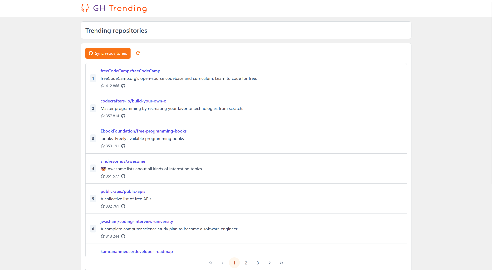

<p align="center">
  <picture>
    <source media="(prefers-color-scheme: dark)" srcset="/frontend/public/logo.dark.svg?raw=true">
    
  </picture>
</p>

This project is a full-stack service that periodically retrieves the top N (up to 1000) most trending repositories
from GitHub based on star count and stores them in a PostgreSQL database. It provides a REST API on Express.js,
a CLI client, and a simple SPA built with Vue.js and Vite.

## Features
- Fetch trending repositories from GitHub every `SYNC_DELAY` minutes.
- Store retrieved repositories in PostgreSQL.
- REST API to fetch repositories by name, ID, or retrieve all.
- CLI client for easy interaction.
- Simple SPA with repository browsing.
- Dockerized setup for easy deployment.

## Requirements
- [Docker](https://www.docker.com/) & [Docker Compose](https://docs.docker.com/compose/)
- [Make](https://www.gnu.org/software/make/)

## Setup & Usage

### Initial Setup
Run the following command to perform initial setup:
```sh
make setup
```

### Start the Service
Launch the service using:
```sh
make up
```
By default, the service will be accessible at: [http://localhost:3000](http://localhost:3000)

### Stop the Service
To stop the service, run:
```sh
make down
```

### CLI Client
You can interact with the service via the CLI client using:
```sh
sh bin/cli <command>
```

## API Endpoints
| Method | Endpoint                         | Description                      |
|--------|----------------------------------|----------------------------------|
| GET    | `/api/repositories`              | Get all repositories             |
| GET    | `/api/repositories/:id`          | Get repository by ID             |
| GET    | `/api/repositories/:owner/:name` | Get repository by name           |
| POST   | `/api/repositories/sync`         | Manually trigger synchronization |

## Frontend (Vue + Vite)



### Available Routes
| Route | Description                                       |
|-------|---------------------------------------------------|
| `/repositories` | Displays the list of repositories with pagination |
| `/repositories/:id` or `/repositories/:owner/:name` | Displays repository details                       |

## Environment Variables

The `.env` file contains the following configurations:
```env
APP_NAME="GH Trending"
APP_DEV=true

# Leave this empty if the app is not publicly hosted, otherwise insert ip or domain.
# Setting the value enables HTTPS and SSL certificate auto-renewal.
APP_HOST=
# Leave this empty if the desired HTTP port is 80.
HTTP_PORT=3000
# Update this when you change APP_HOST or HTTP_PORT.
APP_URL=http://localhost:3000

DB_HOST=postgres
DB_PORT=5432
DB_DATABASE=gh_trending
DB_USER=gh_trending_user
DB_PASSWORD=
DB_URL="postgresql://${DB_USER}:${DB_PASSWORD}@${DB_HOST}:${DB_PORT}/${DB_DATABASE}?schema=public"

# Optional. Setting a token expands the rate limits on the GitHub requests count.
GITHUB_TOKEN=

# Count of trending repositories retrieved from GitHub per synchronization.
# Max value: 1000 (GitHub restrictions).
SYNC_REPO_COUNT=1000
# Delay between synchronizations with GitHub (in minutes).
SYNC_DELAY=60

VITE_APP_NAME="${APP_NAME}"
VITE_APP_URL="${APP_URL}"
VITE_PORT=5173
```
